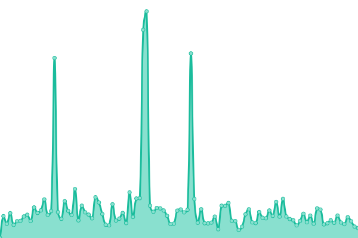
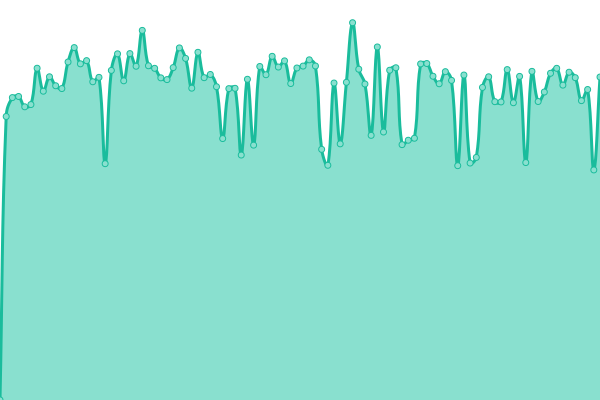
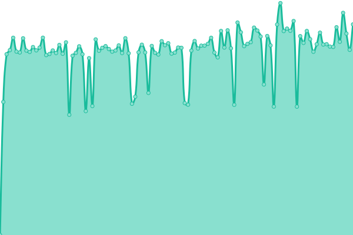

# <!--live status--> **🟩 All systems operational**

This repository contains the open-source uptime monitor and status page for Trident1 tracked clients.

Clients are pinged every 10 minutes in order to check their server time response and verify possible downtimes.

<!--start: status pages-->
<!-- This summary is generated by Upptime (https://github.com/upptime/upptime) -->
<!-- Do not edit this manually, your changes will be overwritten -->
<!-- prettier-ignore -->
| URL | Status | History | Response Time | Uptime |
| --- | ------ | ------- | ------------- | ------ |
|  [Molly's Place](https://www.mollys.com) | 🟩 Up | [molly-s-place.yml](https://github.com/cmatosbc/t1-uptime/commits/HEAD/history/molly-s-place.yml) | 

 293ms
     
 | 

<a href="https://cmatosbc.github.io/t1-uptime/history/molly-s-place">97.21%</a>
    

|  [Molly's Footwear](https://mollys.com/shop/?yith_wcan=1&product_cat=footwear&inventory=1450) | 🟩 Up | [molly-s-footwear.yml](https://github.com/cmatosbc/t1-uptime/commits/HEAD/history/molly-s-footwear.yml) | 

 5159ms
     
 | 

<a href="https://cmatosbc.github.io/t1-uptime/history/molly-s-footwear">93.58%</a>
    

|  [Molly's Ammunition](https://mollys.com/shop/?yith_wcan=1&product_cat=Shooting-ammunition&inventory=1450) | 🟩 Up | [molly-s-ammunition.yml](https://github.com/cmatosbc/t1-uptime/commits/HEAD/history/molly-s-ammunition.yml) | 

 3467ms
     
 | 

<a href="https://cmatosbc.github.io/t1-uptime/history/molly-s-ammunition">96.03%</a>
    

<!--end: status pages-->

[**Visit our status website →**](https://cmatosbc.github.io/t1-uptime)

## 📄 License

- Powered by: [Upptime](https://github.com/upptime/upptime)
- Code: [MIT](./LICENSE) © [Anand Chowdhary](https://anandchowdhary.com), supported by [Pabio](https://pabio.com)
- Data in the `./history` directory: [Open Database License](https://opendatacommons.org/licenses/odbl/1-0/)
